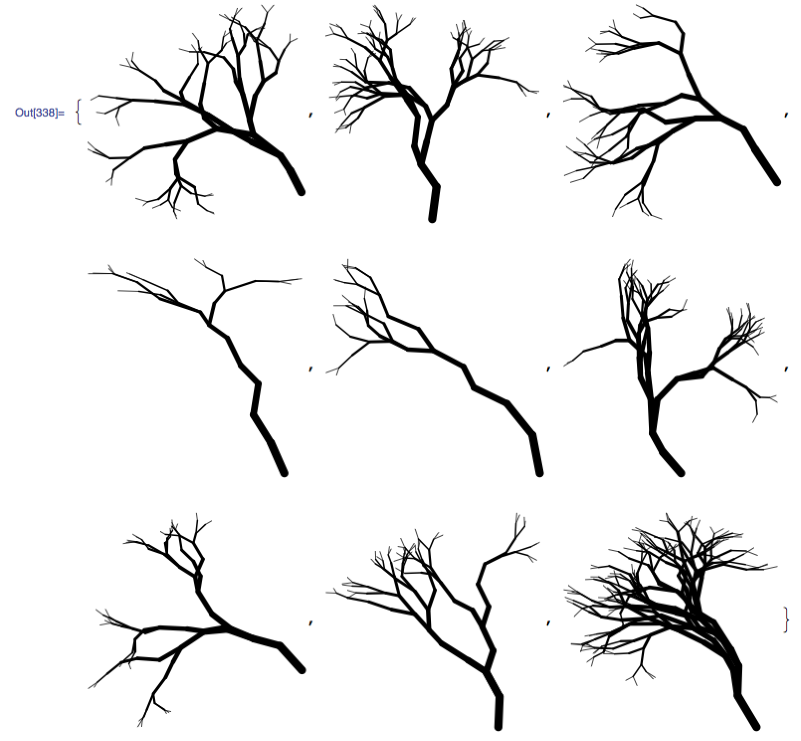
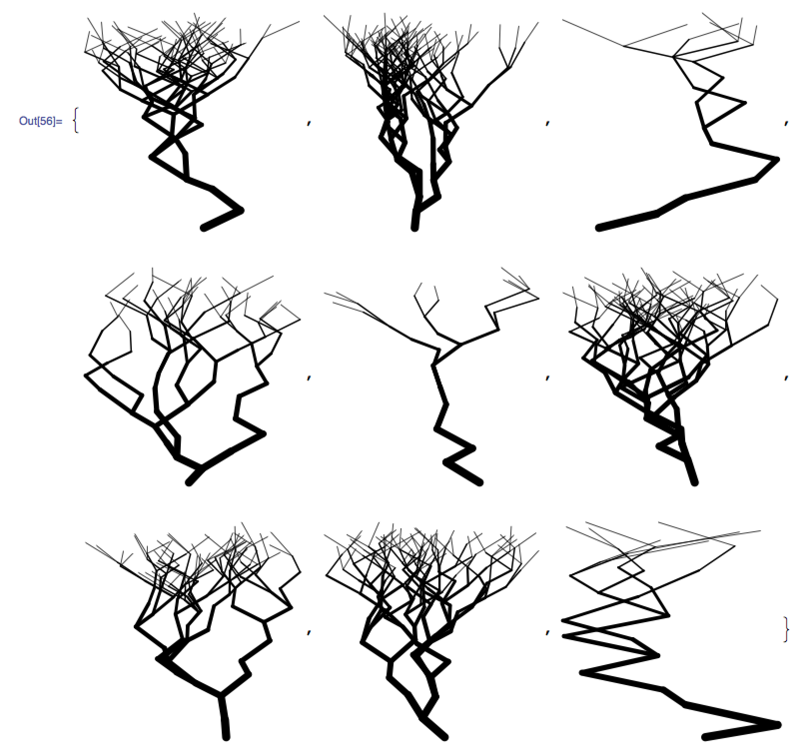

# Trees
Described here is a primitive, fractal method of generating trees using *Mathematica*.  Trees like this:



The algorithm is quite simple:

1. Draw a line segment of [somewhat] random length at a [somewhat] random angle.
1. Decide if the tree is going to bifurcate at this point -- *i.e.* pick random integer between 1 and 2.
1. Call the the same routine which performed both of the above for each of new branches (either 1 or 2).
1. Repeat until the desired depth is achieved.

Most who implement this algorithm are disappointed because the trees do not look realistic:



The inevitable zig-zag fest is due to a subtle yet physically important detail: the angle of the branch is not a mere random number, it is a random **deviation from the branch upon which it grows**.  The angle is given by:

)

**not** by:

)

This correction alone turns what wouldn't even pass for drunken lighting into tree-looking objects.  Variation of length and thickness of the branches play an important role as well.

## Algorithm
```Mathematica
branches[x0_, y0_, maximumDepth_, maximumNfurcation_, maximumDeviation_, initialLean_] := Module[{
    x = x0, y = y0,
    depth = maximumDepth,
    Nfurcation = maximumNfurcation,
    deviation = maximumDeviation,
    lean = initialLean,
    angle, nfurcation, r, x1, y1
    },
    If[depth > 0,
    (* Play around with these two to attain the desired tree structure *)
    (* Angle of the branch *)
    angle = lean + deviation*Random[Real, {-.5, .5}];
    (* Length of the branch *)
    r = Log[depth]*Random[Real, {.5, 1}];
    
    (* Number of branches *)
    nfurcation = RandomInteger[{1, Nfurcation}];
    (* Self-explanatory *)
    x1 = x + r Sin[angle];
    y1 = y + r Cos[angle];
    Append[
      Table[
       branches[
        (* New initial coordinates *)
        x1, y1,
        (* Decremented depth *)
        depth - 1,
        (* Still the same maximum number of branches at each split *)
        Nfurcation,
        (* Still the same maximum deviation of each new branch *)
        deviation,
        (* Angle of the current branch is the initial lean of the next branch *)
        angle
        ],
       {nfurcation}
       ],
      Graphics[
       {
        (* Play around with this *)
        Thickness[depth/300.],
        CapForm["Round"],
        Line[{{x, y}, {x1, y1}}]
        }
       ]
      ] // Flatten,
    {}
    ]
   ];
```
To run/view:

```Mathematica
Show[
 branches[
  (* Initial coordinates *)
  0, 0,
  (* Depth *)
  11,
  (* Maximum number of branches at each split *)
  2,
  (* Deviation range, [-45˚, 45˚], of every new branch *)
  90 \[Degree],
  (* Initial lean angle *)
  0
  ],
 PlotRange -> All,
 AspectRatio -> 1
]
```
or, for a sampling of trees:

```Mathematica
Table[
 Show[
  branches[0, 0, 11, 2, 90 \[Degree], 0],
  PlotRange -> All,
  AspectRatio -> 1
 ],
 {9}
]
```
